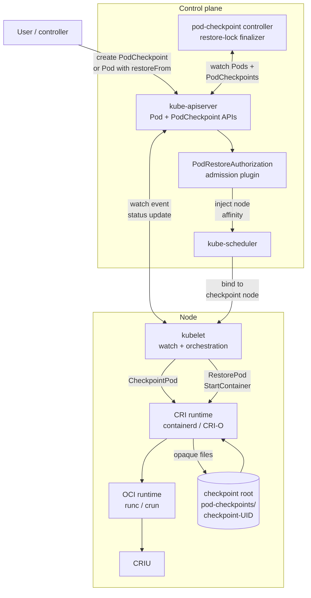
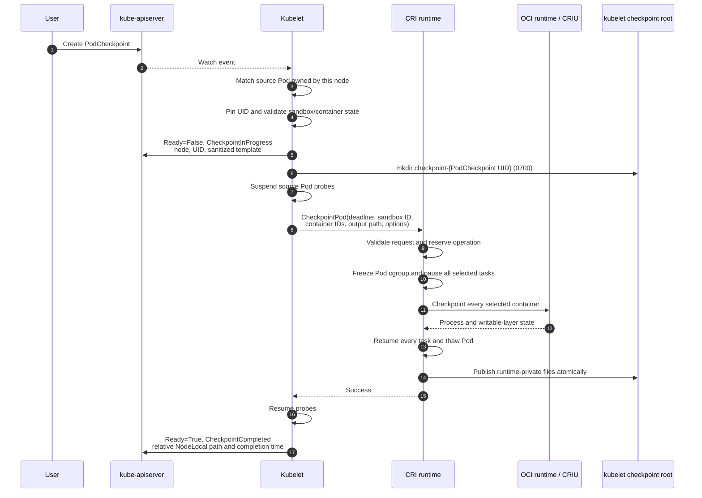
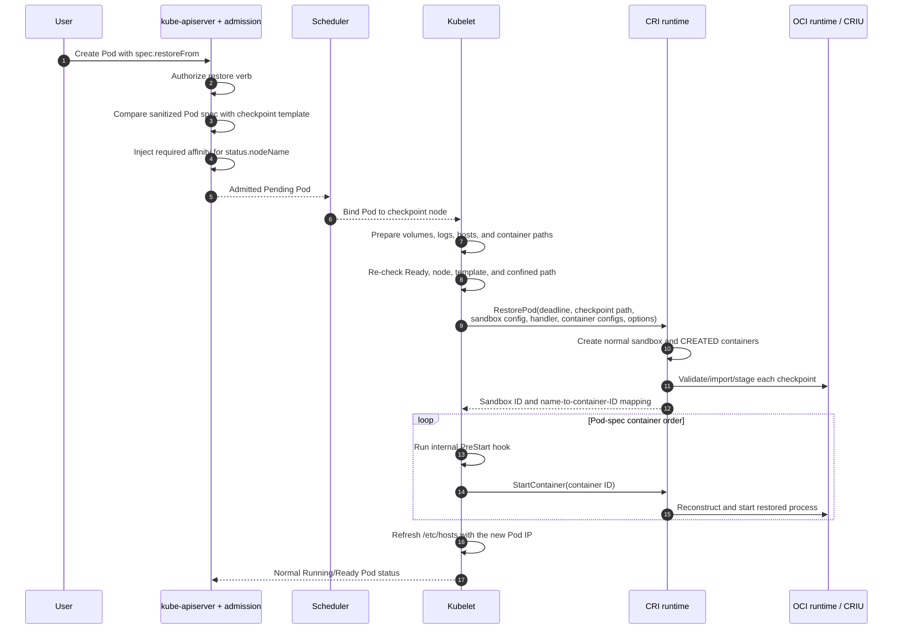

# Pod-level checkpoint and restore architecture

This document describes the implementation of Kubernetes Pod-level
checkpoint/restore developed for KEP-5823. It covers the built-in Kubernetes
API, admission and authorization, kubelet orchestration, the CRI contract, and
the containerd and CRI-O implementations in the adjacent source repositories.

## 1. Purpose and scope

The feature captures the execution state of a running Pod and later resumes
that state in a newly created Pod. A checkpoint includes the selected
containers' process state, memory, open file descriptors, and writable-layer
changes, plus enough runtime metadata to validate and reconstruct the Pod.

The alpha design provides:

- a namespaced, built-in `PodCheckpoint` API;
- declarative checkpointing by creating a `PodCheckpoint`;
- declarative restore through `Pod.spec.restoreFrom`;
- a consistent checkpoint of all regular containers and running restartable
  init containers in a Pod;
- node-local storage owned by kubelet;
- transactional `CheckpointPod` and `RestorePod` CRI calls;
- containerd and CRI-O implementations using CRIU through an OCI runtime; and
- authorization, path confinement, compatibility checks, cleanup, and
  restart-recovery mechanisms.

The current implementation does not provide:

- cross-node restore or checkpoint transport;
- live migration or Pod IP preservation;
- in-place restore into the original Pod object;
- preservation of volumes or other shared Pod resources;
- device or GPU state;
- checkpointing of ephemeral containers or completed non-restartable init
  containers;
- a portable artifact format between runtimes;
- checkpoint quotas, retention policy, or automatic archive garbage
  collection; or
- application notification for clone-specific state such as credentials,
  random-number generators, or network sessions.

Checkpointing always leaves the source Pod running. Deleting it is a separate
user or controller action.

## 2. System overview

The API server stores intent and status. The kubelet that owns the source Pod
performs the checkpoint and writes the result. The pod-checkpoint controller
only protects checkpoints that are in use by restores. The container runtime
owns the low-level checkpoint representation and CRIU interaction.



Important boundaries:

- The API server does not call CRIU and does not copy checkpoint data.
- The controller does not initiate checkpointing and does not call kubelet.
- The scheduler places a restore Pod but does not perform the restore.
- Kubelet understands checkpoint lifecycle and location, but treats the
  contents of a completed checkpoint directory as opaque.
- The runtime validates and interprets its own artifact format.

## 3. API model

### 3.1 `PodCheckpoint`

`PodCheckpoint` is a built-in `node.k8s.io/v1alpha1` type, not a CRD. It is
namespace-scoped and can outlive its source Pod. It shares the existing Node
API group with `RuntimeClass` because checkpoint execution is a SIG Node-owned
kubelet/runtime operation tied to the node running the source Pod. The alpha
version serves `PodCheckpoint`; it does not re-enable the removed alpha
`RuntimeClass` resource.

A minimal request is:

```yaml
apiVersion: node.k8s.io/v1alpha1
kind: PodCheckpoint
metadata:
  name: counter-checkpoint
  namespace: default
spec:
  sourcePod:
    name: counter
    uid: 5b06d68d-1058-43f6-b253-80f7182dbf73
  timeoutSeconds: 60
```

The important spec fields are:

| Field | Meaning |
| --- | --- |
| `sourcePod.name` | Required name of a Pod in the same namespace. |
| `sourcePod.uid` | Optional but recommended instance pin. It prevents a replacement Pod with the same name from being checkpointed. |
| `timeoutSeconds` | Optional operation timeout from 1 to 3600 seconds. Kubelet clamps it to its configured ceiling. |
| `checkpointOptions` | Opaque runtime-specific options. Unsupported options must be rejected, not ignored. They must not contain secrets. |

The spec is immutable for the inputs that affect an operation. Status is
written through the status subresource and contains:

| Field | Owner and purpose |
| --- | --- |
| `nodeName` | Kubelet identity and the node holding the archive. |
| `sourcePodUID` | UID of the Pod instance selected by kubelet. |
| `checkpointLocation` | A typed storage location. Alpha supports only `NodeLocal`, with a path relative to kubelet's checkpoint root. |
| `completionTime` | Time at which the checkpoint became usable. |
| `checkpointedPodTemplate` | Sanitized, authoritative source Pod template used to validate restore. |
| `checkpointedContainers` | Convenience list of captured container names and images. |
| `conditions` | Lifecycle result, summarized by the `Ready` condition. |

The `Ready` condition uses these states:

| Status | Reason | Meaning |
| --- | --- | --- |
| `False` | `CheckpointInProgress` | Kubelet has claimed the request and the runtime operation is running. |
| `True` | `CheckpointCompleted` | The checkpoint directory is complete and may be restored. |
| `False` | `CheckpointFailed` | Setup, runtime execution, cleanup, or status publication failed. |
| `False` | `SourcePodReplaced` | The live Pod UID does not match the pinned or previously observed UID. |

`Pending` exists as a well-known reason, although newly created objects start
with empty status and are claimed by kubelet through the watch.

### 3.2 Restore reference on `Pod`

Restore creates a new Pod whose complete spec matches the captured template and
adds one field:

```yaml
apiVersion: v1
kind: Pod
metadata:
  name: counter-restored
  namespace: default
spec:
  restoreFrom:
    name: counter-checkpoint
    options: {}
  # The remaining Pod spec repeats the checkpointed workload spec.
```

`restoreFrom.name` references a `PodCheckpoint` in the same namespace.
`restoreFrom.options` contains options for this restore attempt; it is separate
from checkpoint-time options. The reference is immutable, and restore applies
only to the Pod's first sandbox creation. A later sandbox loss follows the
normal restart policy instead of replaying an old memory image.

While the first sandbox is being restored, kubelet reports a `Restoring`
condition:

- `True`, reason `RestoringSandbox`, while this Pod's restore is running;
- `False`, reason `RestoreInProgress`, while another restore with the same
  namespace/name holds the node-local restore lock; and
- absent after the restored sandbox is available.

## 4. Component responsibilities

| Component | Responsibilities | Explicitly does not do |
| --- | --- | --- |
| kube-apiserver | Serves the built-in API; validates immutable fields; keeps spec and status separate; runs restore admission and authorization. | Execute a checkpoint, inspect an archive, or contact CRIU. |
| Pod restore admission | Authorizes the `restore` verb, validates Pod-template equality, rejects direct `nodeName`, and injects required node affinity for the checkpoint node. | Restore processes or bypass the scheduler. |
| kube-scheduler | Schedules the new Pod under the injected node constraint. | Select a different node in alpha or transport data. |
| pod-checkpoint controller | Adds `node.k8s.io/restore-lock` while a Pending Pod is restoring and removes it afterward. | Execute checkpoints, write checkpoint status, or call kubelet. |
| kubelet | Watches requests, validates live Pod state, selects containers, owns storage and deadlines, calls CRI, writes status, and integrates restore into `SyncPod`. | Interpret runtime-owned checkpoint files. |
| CRI runtime | Implements atomic Pod-level checkpoint and restore transactions, validates runtime compatibility, and cleans partial resources. | Define Kubernetes authorization or scheduling policy. |
| OCI runtime and CRIU | Freeze and serialize processes, then reconstruct them from the runtime's checkpoint representation. | Manage Kubernetes API objects. |
| cri-tools | Exposes direct diagnostic `checkpointp` and `restorep` commands for the CRI RPCs. | Implement Kubernetes lifecycle or policy. |

## 5. Checkpoint flow

Creating the API object is the only Kubernetes-level trigger. There is no
imperative kubelet HTTP endpoint.



### 5.1 Kubelet selection and concurrency

For alpha, every enabled kubelet watches `PodCheckpoint` objects cluster-wide
and filters locally. A kubelet acts only when the named source Pod is in its Pod
manager and assigned to that node.

Before calling CRI, kubelet requires:

- a bound Pod and a ready sandbox;
- all non-restartable init containers to have completed;
- all regular containers to be running; and
- each running restartable init container to be included.

The selected CRI container ID list contains running restartable init containers
followed by all regular containers. Ephemeral containers are excluded.

A per-Pod operation gate prevents duplicate checkpoints and prevents an
ephemeral container from being created or started while the checkpoint selects
and freezes its consistency group. Kubelet also suspends startup and liveness
probes for the checkpoint window so a frozen process is not killed because a
probe timed out.

### 5.2 Deadline and source-Pod behavior

The default kubelet `podCheckpointTimeout` is 15 seconds. A request may ask for
less, but a larger value is clamped to the kubelet setting. Kubelet places this
deadline on the gRPC context; both runtime implementations reject calls without
a finite deadline.

On success or failure the runtime must return every selected process to a
running state before the CRI call returns. The expensive packaging/export step
is performed after the processes have resumed where the runtime supports that
separation. The source Pod is never deleted or stopped by the API operation.

### 5.3 Kubelet-owned storage and publication

Kubelet creates a private deterministic directory:

```text
<kubelet-root>/pod-checkpoints/checkpoint-<PodCheckpoint-UID>/
```

The default is therefore:

```text
/var/lib/kubelet/pod-checkpoints/checkpoint-<PodCheckpoint-UID>/
```

The CRI request receives the absolute path to an existing empty directory. The
runtime must write only within it, remove partial output on failure, and leave
the directory itself under kubelet ownership. Kubernetes status exposes only
the leaf name relative to the checkpoint root.

Kubelet publishes `Ready=True` only after the CRI call succeeds. If publishing
the completed status fails, kubelet removes the otherwise undiscoverable output
rather than leaving an untracked archive containing Pod memory.

## 6. Restore flow

Restore is a specialized first sandbox creation inside the normal Pod sync
loop. It remains scheduler-, volume-, CNI-, device-manager-, and lifecycle-hook
aware.



### 6.1 Admission, scheduling, and equality

Creating the restore Pod requires the non-standard `restore` verb on the named
`podcheckpoints` resource. Reading a checkpoint object is deliberately not
sufficient authority to execute its captured memory.

The `PodRestoreAuthorization` admission plugin:

1. reads the referenced checkpoint;
2. rejects restore before `status.nodeName` exists;
3. rejects a user-supplied `spec.nodeName`;
4. injects a `metadata.name In [checkpoint-node]` requirement into every term
   of required node affinity, preserving the user's AND/OR semantics;
5. performs an authorization check for `restore` on the exact namespaced
   checkpoint; and
6. validates the new Pod against `status.checkpointedPodTemplate`.

Template capture retains user-meaningful labels, annotations, owner references,
and the Pod spec. The symmetric sanitizer removes only:

- `spec.nodeName`;
- the `restoreFrom` invocation; and
- node-identity placement constraints using `kubernetes.io/hostname` or
  `metadata.name`.

All other Pod-spec fields must match, including the container set, images,
commands, environment, mounts, resources, security contexts, hostname, and
non-identity scheduling constraints. Kubelet repeats the comparison immediately
before CRI restore as defense in depth.

### 6.2 Path and node validation

Kubelet rejects restore unless the checkpoint is `Ready=True` and its
`status.nodeName` equals the local node. It resolves the relative
`NodeLocal.path` below its configured checkpoint root and rejects:

- empty or absolute paths;
- `.` and parent traversal;
- non-directories; and
- symlinks that resolve outside the checkpoint root.

This check prevents a status value from causing the privileged runtime to read
an arbitrary host path.

### 6.3 CRI restore transaction

`RestorePod` receives a complete restore-time `PodSandboxConfig`, runtime
handler, one `ContainerConfig` for every checkpointed container, and a finite
deadline. The runtime must:

- validate the runtime-private artifact and its compatibility with the request;
- create a fresh sandbox using the normal CNI and runtime path;
- create exactly one container per requested name;
- prepare every container in `CREATED` state without executing the restored
  process;
- return a non-empty sandbox ID and a unique name-to-container-ID mapping; and
- remove all resources it created if any step fails.

Kubelet validates the entire response before starting anything. It then runs
internal pre-start hooks and `StartContainer` in deterministic Pod-spec order.
Post-start hooks are not repeated because they already ran in the checkpointed
execution history. If a hook or start fails, kubelet removes the partially
restored sandbox.

Image availability remains part of normal container creation. containerd can
pull missing base images during restore. CRI-O also attempts a pull, but the CRI
restore request carries no registry credentials, so private images must already
exist locally.

After the sandbox receives its new CNI address, kubelet rewrites the already
mounted hosts file. The implementation does not preserve the source Pod IP or
promise that established external connections survive.

## 7. CRI contract

The CRI `RuntimeService` adds two unary RPCs.

### 7.1 `CheckpointPod`

```text
CheckpointPodRequest
  pod_sandbox_id   required, ready sandbox
  output_path      required absolute existing empty directory
  container_ids    non-empty, unique, running containers in the sandbox
  options          opaque runtime-specific map

CheckpointPodResponse
  empty; the caller already owns output_path
```

The runtime contract requires one Pod-wide cut: pause every selected container
before capturing any, keep them paused until all have been captured, and resume
all of them before returning on success, error, cancellation, or deadline.

### 7.2 `RestorePod`

```text
RestorePodRequest
  checkpoint_path  required absolute checkpoint directory
  config            restore-time PodSandboxConfig
  runtime_handler   selected runtime implementation
  options           opaque runtime-specific map
  container_configs exact restore container set, matched by metadata.name

RestorePodResponse
  pod_sandbox_id
  restored_containers[] { name, container_id }
```

The checkpoint remains authoritative for process and filesystem state. The
request describes the expected process and supplies restore-time settings such
as new Pod identity, cgroup paths, logs, mounts, devices, resource constraints,
and security policy. A runtime must fail incompatible combinations rather than
silently changing the restored process.

Both calls are transactions. A failed checkpoint leaves no partial public
artifact and no frozen source process. A failed restore leaves no sandbox or
container created by the call.

## 8. Runtime-independent transaction rules

Both current runtime implementations follow the same high-level invariants:

1. Validate all identities, states, container membership, paths, and options
   before freezing or creating resources.
2. Reserve the Pod, selected containers, and output or restore identity to
   reject overlapping operations.
3. Persist recovery intent before entering a state that cannot safely be
   inferred after a daemon restart.
4. Freeze the Pod cgroup before pausing individual tasks. This closes the gap in
   which one container could continue changing shared state while another is
   paused.
5. Capture all selected tasks while all remain paused.
6. Resume individual tasks and thaw the Pod before returning, including error
   and cancellation paths.
7. Publish files atomically and sync their parent directory.
8. Validate the complete restore input before consuming it.
9. Keep restored containers inert until kubelet has validated the result and
   run pre-start hooks.
10. Roll back all newly created runtime resources if restore does not commit.

The runtime does not promise that a checkpoint from one implementation can be
restored by another, even when both use CRIU.

## 9. containerd implementation

containerd separates CRI transaction ownership from sandbox-specific
checkpoint mechanics.

### 9.1 Sandbox-controller extension

`core/sandbox.CheckpointController` is an optional capability:

```go
type CheckpointController interface {
    Checkpoint(context.Context, string, CheckpointOptions) error
    Restore(context.Context, string, RestoreOptions) (RestoreResult, error)
}
```

Inputs and outputs are data-only. The CRI service retains ownership of CRI
stores and lifecycle calls, while the selected sandbox controller owns how a
sandbox is checkpointed. Existing controllers that do not implement this
interface remain valid and return `Unimplemented` for Pod checkpoint/restore.
Equivalent optional RPCs exist on the sandbox service boundary, allowing an
out-of-process or VM-oriented controller to provide another implementation.

The current pause-container controller implements the capability using
containerd tasks, checkpoint images, the cgroup v1/v2 freezer, and CRIU through
the runc-v2 shim.

### 9.2 containerd checkpoint layout

A completed directory contains:

```text
checkpoint-<PodCheckpoint-UID>/
├── pod-config.json
├── checkpoint-manifest.json
├── container-<container-ID>.tar
└── ... one OCI checkpoint archive per selected container
```

The versioned manifest maps stable container names to checkpoint-time IDs,
archives, saved CRI container configs, and container statuses. The sandbox
configuration is stored separately. Files are mode `0600` beneath kubelet's
mode `0700` directory.

For each container, containerd creates a temporary content-addressed checkpoint
image containing runtime state, task state, and the writable layer. All tasks
remain paused until those checkpoint images exist. It then resumes the Pod and
exports each image to an OCI tar archive. Export uses a temporary file, `fsync`,
rename, and directory sync, so tar serialization is outside the source freeze
window and a final archive is never partially published.

Temporary checkpoint image records are deleted after export.

### 9.3 containerd restore

The CRI layer first creates the new sandbox and all new container metadata and
snapshots. The pause controller then, for each requested container:

1. opens the checkpoint directory and archive without following unsafe paths;
2. validates file type, size, tar entry count, canonical paths, entry types,
   OCI descriptors, and content digests;
3. matches the manifest entry by container name;
4. checks sandbox security, sysctls, ports, image, command, arguments, working
   directory, environment, TTY, and process security context;
5. imports the OCI checkpoint into the content store under a deterministic,
   restore-scoped image name;
6. verifies the base image config digest and OCI runtime name;
7. applies the captured writable-layer diff to the new snapshot; and
8. returns the prepared task-checkpoint image to CRI.

CRI records that image on the new container's durable status. The subsequent
`StartContainer` loads it with `WithTaskCheckpoint`, asks the shim/OCI runtime to
construct the restored task, starts it, and then deletes and clears the consumed
temporary image. Removing an unstarted restored container also deletes the
owned temporary image.

### 9.4 containerd recovery

Before freezing, the pause controller writes and syncs a recovery marker with
the sandbox ID, cgroup parent, and selected container IDs. On any normal error,
a cancellation-resistant cleanup context thaws the cgroup and resumes each
paused task before removing the marker.

At containerd plugin startup, recovery runs before the controller begins
serving. Any remaining marker causes containerd to recover the source Pod and
remove temporary checkpoint images. Startup fails rather than serving with an
unresolved marker whose safety cannot be established.

## 10. CRI-O implementation

CRI-O implements the same CRI lifecycle directly in its server and uses its
existing container checkpoint/restore machinery.

### 10.1 CRI-O checkpoint layout

```text
checkpoint-<PodCheckpoint-UID>/
├── pod-config.json
├── checkpoint-manifest.json
└── containers/
    ├── <sha256-of-container-ID>.tar
    └── ... one archive per selected container
```

The versioned manifest identifies the format as `cri-o`, records the resolved
runtime handler, maps names to IDs and archive paths, embeds saved container
configs, and records a SHA-256 checksum for every archive.

CRI-O freezes the sandbox cgroup, pauses every selected container, and invokes
its container checkpoint path with caller-owned pause/resume and deferred
archive creation. It prepares the immutable CRIU and writable-layer data for
all containers, resumes the Pod, and only then writes the tar archives. This
keeps archive creation outside the source freeze window. Partial output is
removed on failure.

### 10.2 CRI-O restore

CRI-O validates the runtime identity, archive checksums, sandbox configuration,
container set, and process-relevant configuration. It creates a normal sandbox
and `CREATED` containers, copies each checkpoint archive into CRI-O-owned
container storage, and persists two fields on the container:

```text
restore = true
restoreArchive = <CRI-O-owned path>
```

`RestorePod` returns without running any restored process. On the first
`StartContainer`, CRI-O detects the pending state and calls `ContainerRestore`
instead of the normal runtime start. After success it clears and persists the
restore fields and removes the staged archive. Later restarts use the normal
container start path; the checkpoint is not replayed.

### 10.3 CRI-O recovery

CRI-O has two durable journals:

- a checkpoint recovery marker, written before freezing, allows startup to
  thaw the sandbox cgroup and resume selected containers; and
- a restore transaction record tracks sandbox and container creation so an
  interrupted `RestorePod` can be rolled back before new work is accepted.

Pending per-container restore state is stored with container state, so a CRI-O
restart after a successful `RestorePod` but before `StartContainer` does not
lose the prepared restore.

## 11. Security model

Checkpoint data is equivalent to a privileged memory dump. It may contain
environment variables, credentials, cryptographic material, process memory,
filesystem changes, and file-descriptor state.

The design uses several independent controls:

### 11.1 Authorization

- Normal RBAC controls create/read/update/delete access to `PodCheckpoint`.
- Restore requires the additional `restore` verb on the exact checkpoint.
- Kubelets receive get/list/watch access to checkpoints and update/patch access
  to `podcheckpoints/status`.
- `NodeRestriction` narrows status writes: a node may initially claim only a
  checkpoint whose source Pod is bound to that node, and only the recorded node
  may write later status updates.
- The controller can update only the main object/finalizer path; it does not own
  checkpoint status.

### 11.2 API integrity

- Main-resource writes cannot modify status.
- Status-subresource writes cannot modify spec.
- Source identity and operation options are immutable.
- Restore admission and kubelet both compare the new Pod with the captured
  template.
- The controller's restore-lock finalizer prevents checkpoint deletion while a
  Pending restore Pod depends on it.

### 11.3 Filesystem and artifact integrity

- Kubelet creates private directories and supplies an already validated output
  root.
- Kubelet never publishes an absolute host path in API status.
- Restore paths are checked lexically and after symlink resolution.
- Runtimes reject symlink roots, unsafe archive paths, unexpected file types,
  malformed manifests, excessive sizes/counts, and incompatible runtime data.
- Runtime-specific temporary artifacts are deterministic or transaction-scoped
  and are removed on completion, abandonment, or recovery.

The alpha design does not encrypt archives. Protecting the kubelet root,
backups, and any future transport is an administrator responsibility.

## 12. Failure and restart semantics

| Failure point | Required behavior |
| --- | --- |
| Before CRI checkpoint starts | Kubelet records `CheckpointFailed`; no runtime transaction exists. |
| During freeze or capture | Runtime resumes all tasks, thaws the Pod, removes partial artifacts, and returns an error. |
| Runtime restart during checkpoint | Runtime recovery marker drives thaw/resume before service becomes available. |
| Kubelet restart during checkpoint | Kubelet marks an unrecoverable in-progress API operation failed and removes its deterministic partial output before accepting a replacement operation. |
| Checkpoint succeeds but status cannot be published | Kubelet removes the untracked archive; it does not advertise a location it cannot safely own. |
| Restore validation fails | No sandbox should be created, or any newly created resources are rolled back. |
| Restore fails after partial creation | Runtime/kubelet removes all new containers and the sandbox. The declarative Pod remains Pending and may retry. |
| Runtime restart after `RestorePod`, before `StartContainer` | Prepared restore ownership must remain durable; containerd records its task checkpoint, while CRI-O persists restore state and the staged archive. |
| Sandbox loss after a successful restore | Kubelet follows normal Pod restart policy. It does not restore the original checkpoint a second time. |

One operational consequence is important: restarting a runtime that cannot
reconstruct all CRI bookkeeping for already running containers may cause
kubelet to report those containers as unknown or recreate them. A restore Pod
with `restartPolicy: Never` may become terminal in that situation. Runtime
daemon restart continuity is distinct from checkpoint transaction recovery and
must be tested separately.

## 13. Configuration and dependencies

Every Kubernetes component that consumes the gated surface must enable:

```text
PodLevelCheckpointRestore=true
```

The API server must also serve the alpha API:

```text
--runtime-config=node.k8s.io/v1alpha1=true
```

Kubelet supports:

```yaml
podCheckpointTimeout: 15s
```

The current runtime gates are:

- containerd CRI plugin:

  ```toml
  enable_checkpoint_restore = true
  ```

  `enable_criu` remains a deprecated alias.

- CRI-O:

  ```toml
  [crio.checkpoint_restore]
  container_level_enabled = "checkpoint_restore"
  ```

The node must run Linux and provide a compatible OCI runtime and CRIU. The
containerd pause-controller implementation additionally requires a usable Pod
cgroup freezer. The runtime handler used for restore must understand the
checkpoint produced during capture.

## 14. Observability and diagnostics

The primary user-visible signals are:

- `PodCheckpoint.status.conditions[type=Ready]` and its reason/message;
- `PodCheckpoint.status.nodeName`, `completionTime`, and location;
- the restore Pod's `Restoring`, `PodReadyToStartContainers`, `Ready`, and
  `ContainersReady` conditions;
- Kubernetes events such as `CheckpointNotReady`, `CheckpointWrongNode`,
  `PodSpecMismatch`, and `RestoreInProgress`;
- kubelet logs around the checkpoint watch and `SyncPod` restore path;
- containerd or CRI-O logs for transaction and archive validation; and
- per-container CRIU dump/restore logs owned by the OCI runtime.

Useful checks for the local implementation are:

```bash
kubectl get podcheckpoint -A
kubectl describe podcheckpoint -n <namespace> <name>
kubectl describe pod -n <namespace> <restore-pod>
journalctl -u kubelet --since '10 minutes ago'
journalctl -u containerd --since '10 minutes ago'
```

For the dedicated local demo runtime, use its actual socket and service name:

```bash
sudo crictl --runtime-endpoint \
  unix:///run/containerd/kep-5823/containerd.sock info
journalctl -u kep-5823-containerd.service --since '10 minutes ago'
```

## 15. Current limitations and follow-up work

The most important missing production features are:

1. **Archive lifecycle management.** Deleting a `PodCheckpoint` does not remove
   its node-local directory. Quotas, retention, disk-pressure behavior, and
   garbage collection need an explicit design.
2. **Node-scoped watch routing.** Alpha has every kubelet watch all
   `PodCheckpoint` objects and filter locally.
3. **Cross-node transport and compatibility.** The location union permits
   future storage backends, but alpha accepts only same-node `NodeLocal` data.
4. **Network identity.** A restored Pod receives a new sandbox and CNI address;
   established TCP sessions are not preserved.
5. **Volumes and projected credentials.** Volume contents are outside the
   checkpoint contract. Automatically projected service-account tokens can
   differ between Pod instances and checkpointed tokens can expire.
6. **Devices and accelerators.** GPU memory, driver state, DRA claims, device
   mapping, and multi-Pod coordination are separate follow-on work.
7. **Format efficiency.** Both current runtimes package one tar archive per
   container. Packaging has been moved outside the frozen window, but it still
   consumes CPU, I/O, and temporary storage. A future controller/runtime format
   could retain content-addressed blobs or use a directory/streaming interface,
   provided it preserves atomic publication, integrity validation, ownership,
   and rollback semantics.
8. **Runtime restart continuity.** Durable transaction recovery is implemented,
   but retaining complete CRI visibility for unrelated running Pods across a
   daemon restart remains a separate runtime concern.

## 16. Source map

The architecture above is implemented primarily in these files.

### Kubernetes

- API types: `staging/src/k8s.io/api/node/v1alpha1/types.go`
- Pod restore field: `staging/src/k8s.io/api/core/v1/types.go`
- API validation/storage: `pkg/apis/node/validation/validation.go`,
  `pkg/registry/node/podcheckpoint/`
- Template sanitization: `pkg/apis/node/util/sanitize.go`
- Restore admission: `plugin/pkg/admission/podrestoreauthorization/`
- Node status restriction: `plugin/pkg/admission/noderestriction/admission.go`
- Lifecycle controller: `pkg/controller/podcheckpoint/`
- Kubelet checkpoint watch: `pkg/kubelet/pod_checkpoint_watch.go`
- Kubelet checkpoint execution and recovery: `pkg/kubelet/kubelet.go`,
  `pkg/kubelet/kubelet_pods.go`
- Kubelet restore orchestration: `pkg/kubelet/kuberuntime/`
- Pod restore condition: `pkg/kubelet/status/generate.go`
- CRI definition: `staging/src/k8s.io/cri-api/pkg/apis/runtime/v1/api.proto`

### containerd

- CRI transaction layer: `internal/cri/server/sandbox_checkpoint_api.go`
- Sandbox-controller contract: `core/sandbox/controller.go`
- Pause-controller implementation: `internal/cri/server/podsandbox/`
- Prepared task ownership/start: `internal/cri/server/container_start.go`,
  `internal/cri/store/container/status.go`
- Configuration: `internal/cri/config/config.go`

### CRI-O

- CRI validation and shared format types: `server/pod_checkpoint.go`
- Checkpoint transaction/recovery: `server/pod_checkpoint_linux.go`
- Restore transaction/recovery: `server/pod_restore_linux.go`
- Durable pending restore: `internal/oci/container.go`
- Restore consumption: `server/container_start.go`
- Existing low-level checkpoint mechanics: `internal/lib/checkpoint.go`

### Tools and runnable example

- Direct CRI CLI: `cri-tools/cmd/crictl/pod_checkpoint.go`
- End-to-end counter workflow: `examples/01-create-pod.sh` through
  `examples/04-restore-pod.sh`
- Local isolated kubeadm cluster: `examples/kubeadm-cluster/`
